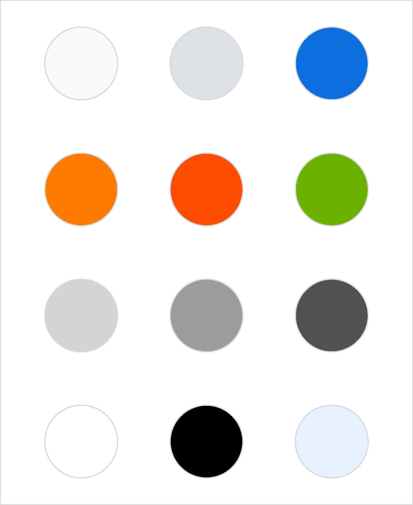
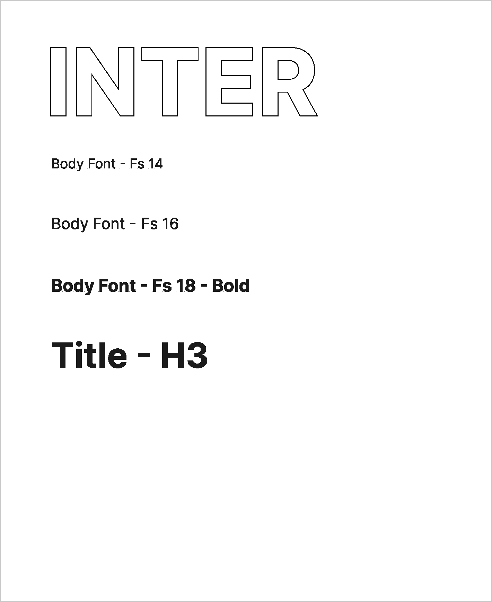
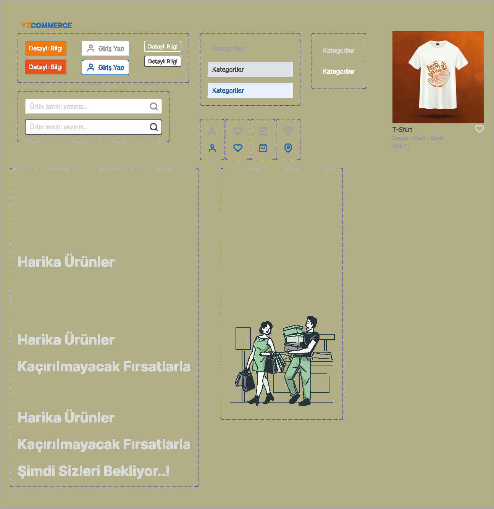
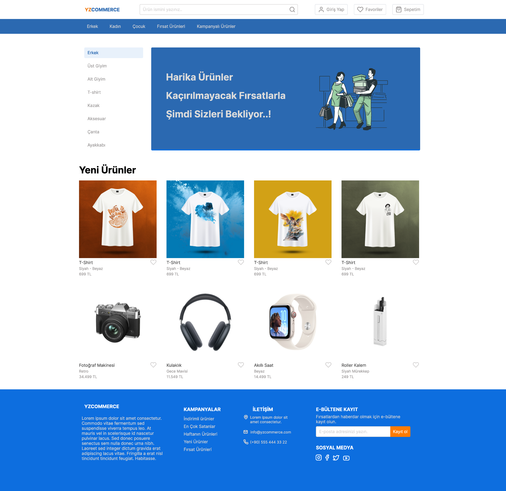

# 🛍️ YZCOMMERCE - Figma E-Ticaret Arayüz Tasarımı

Bu proje, temel bir e-ticaret web sitesinin kullanıcı arayüzünü Figma kullanarak tasarladığım örnek çalışmadır. 
Tasarım, renk paleti, tipografi, bileşenler (components) ve ana sayfa gibi temel UI öğelerini içermektedir.

## 🎯 Amaç

- UI/UX becerilerimi geliştirmek
- Figma üzerinden görsel tutarlılık, düzen ve komponent sistemini uygulamak
- GitHub üzerinden portföy oluşturmak

---

## 🖼️ Sayfa Görselleri

### 🎨 Renk Paleti


### 🔤 Tipografi


### 🧩 Bileşenler (Buttons, Icons, Inputs)


### 🖥️ Ana Sayfa Tasarımı


---

## 📁 Dosya Yapısı

```
e-ticaret_arayuz_tasarimi/
├── 01-colors.png         # Renk paleti
├── 02-typography.png     # Kullanılan yazı fontları ve stilleri
├── 03-components.png     # UI bileşenleri (butonlar, arama kutusu, ikonlar vb.)
├── 04-homepage.png       # Tam sayfa e-ticaret ana sayfa tasarımı
└── README.md             # Proje açıklaması ve görsel referansları (henüz eklenmedi)
```

---

## ✍️ Notlar

> Bu proje, Figma üzerinde temel seviyede bir e-ticaret arayüzü denemesi yapmak amacıyla hazırlanmıştır. 


